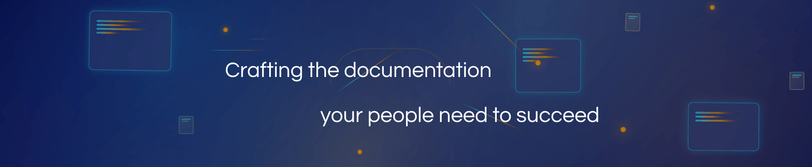

# My Portfolio

<figure><figcaption></figcaption></figure>

## About me

**I'm passionate about crafting documentation** that helps people achieve their goals, transforming complex processes or technical concepts into clear, valuable, and actionable resources. With over 8 years of experience as a Technical Writer and Documentation Manager, I've discovered that great documentation isn't just about writing—it's about understanding the goals of your product, your team, and the language and needs of your audience, then building bridges between completeness, complexity, and clarity.

### My approach

I look at technical writing **documentation as a user-centric craft** built on the pillars of **empathy and communication, clarity, structure, and design**. In practice, I follow a four-phase workflow to treat documentation as a living product.

This process begins with **strategic communication and content planning**, where I identify key stakeholders, main friction points and challenges, and available resources to develop a project roadmap that aligns business objectives with user needs. I then move into the **creation and structuring** phase, applying a lean mindset and efficient workflows to transform complex information into simple, actionable guides, and reinforcing communication with all the involved parties.

<figure><figcaption></figcaption></figure>

_<mark style="color:$info;">Image: Flow chart of my documentation crafting approach.</mark>_

The next phase, **refinement and validation**, involves developing a comprehensive quality assurance process, which includes implementing CI/CD automations (grammar, typos, style and links checks) and gathering user feedback through regular channels.&#x20;

Finally, the **delivery and maintenance** phase ensures long-term value by continuously optimizing information architecture, keeping documentation relevant as the product evolves, and supporting our users' success.

### What energizes me most?

**Continuous learning, teamwork, the agile mindset, hitting deadlines and reaching goals** drive me. I'm currently diving deep into Python programming, API documentation, and how to include GenAI tools in technical writing workflows efficiently. Whether it's implementing docs-as-code workflows, conducting user research to align content with users' real needs, or mentoring teams on best practices, I thrive in environments where technology meets human-centered communication.

We, technical writers, translate ideas, process, and innovations, crafting a whole reality for your people (our users) to succeed.

### Are you ready?

Transform your documentation strategy? Let's connect and explore how we can empower your users together. Please feel free to drop me[ a message](https://www.linkedin.com/in/javier-hernandez-fernandez/)!

## What I've Done

I have extensive experience in crafting content and communication strategies that align with company values and business objectives, as well as improving information architecture to meet user needs.&#x20;

Here is a summary of the different types of documentation I have created and refined:

* Informative and descriptive product/project pages
* Tutorials (for end-users and onboarding new hires)
* Documentation style guides
* How-to guides
* Developer documentation
* Release notes and changelogs
* Troubleshooting and Frequently Asked Questions (FAQs) pages

## Related Links

* [Portfolio](https://documentation-crafter.javierhfernandez.es/wp/)
* [Linkedin Profile](https://www.linkedin.com/in/javier-hernandez-fernandez/)
