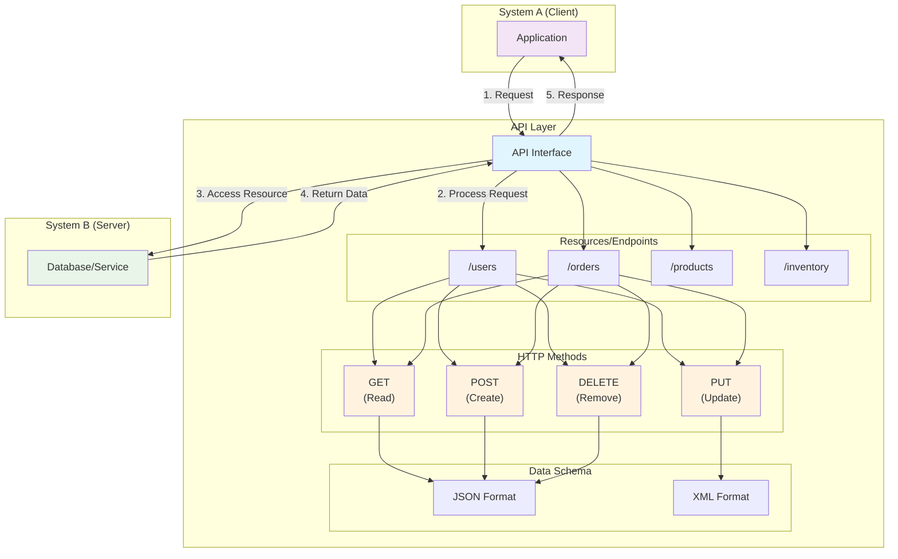
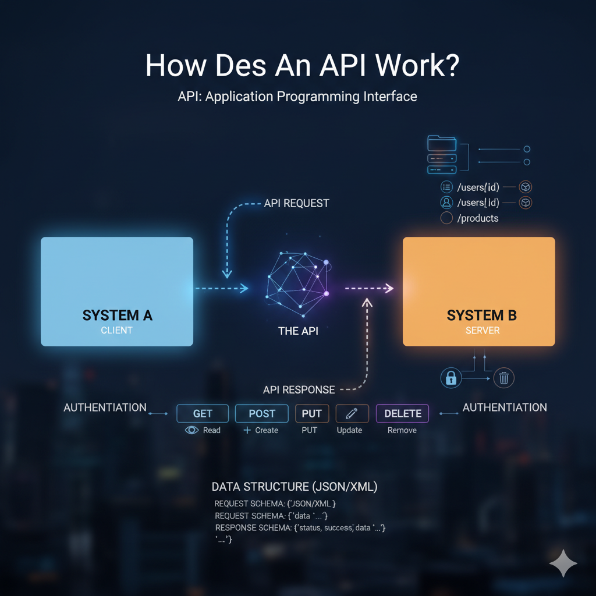

# Understanding API Documentation

## Introduction

API documentation seems a straight forward road until you start analyzing the actual API documentation of different companies. That's the moment when the "conceptual" documentation and the "reference" documentation seem to blurry or even merge, and when the only common section seems to be "Getting Started" (or was it "Quick Start"?).

After a year of self-study I invest some money in the course Master API Documentation just to learn a few things I did not know, but specially to realize how much I had learn by myself. This article intends to provide a mental map or narrative to grasp the fundamentals of API documentation.

## What is an API?

API stands for Application Progamming Interface ans is a piece of code that acts as interface between two systems by defining a set of availalbe resources, tne methods to interact with them, and the data structure or schemas that ensure a successful communication.

## How does an API work?

An API allos communication between two systems (interfacing) by defining a set of available resources, the methods to interact with those resrouces, and the data structures or schema to be used during communication.

Resources are also called endpoints and consists of folder paths in a server pointing to the resources that offers our API. The methods allowing interacting with the resources consists of HTTP methods that establish which specific operations are allowed for a specific resource. The most used HTTP methods used in API are _GET_ (read the content of a resource), _PUT_ (Update a resource completely), _POST_ (Adda new resource), and _DELETE_ (Removea resource).

## How do APIs Orchestrate Communication Between Systems?

For two systems to communicate using an API, systthey need to know the available resources, the method to interact with those resoruces, and the data schema required (JSON or XML are the most frequent) to make a request, and the schema of the responde to be received.

<figure><figcaption></figcaption></figure>

Once system A knows all that, senda request using a method available. System B receives the request, checks that the requested resource exists - and that System A is who it claims to be (authentication) and has permissions to access the resource (authorization) - and send the required resource using the defined data schema. System B, that knows which data schema to expect, receives the response and manages the data according to its goals.

## Organizing our API

We can "organize" our API as we desire, but if we want to engange as many users as possible, we better follow one the available API specifications, for example OpenAPI and Azarro.

API specification levarages the design process and ensures that our API structure and features are clearly explained and easily understood by our users and customers. Specifications achieve that by standardizing the structure of our API easing the process of communicating our API's story.

| Specification                                                           | Description | Use Cases  |
| ----------------------------------------------------------------------- | ----------- | ---------- |
| [OpenAPI](https://www.openapis.org/what-is-openapi)                     | TO BE DONE  | TO BE DONE |
| [Arazzo](https://swagger.io/blog/the-arazzo-specification-a-deep-dive/) | TO BE DONE  | TO BE DONE |

OpenAPI and Azurro specification are build around objects with is own elements (in YAML or JSON format) that are machine and human readable at the same time.

## What is API Documentation?

API documentation is a set of documentas or sections in a single document that tell our users and customers the story of our API abd the _What_ and _How_ of our features. It is commonly structure aroung two main abstract sections: conceptual documentation and reference documentation.

The conceptual documentation briefly introduces our API (what it is ,what it does, why it is useful), engange users to get started with our API (first API call, security basics, How-Tos for most used actions); the reference documentation provides comprehensive information about the ins and outs of our API (list of resources and the available methods, data schemas for both request and responses, HTTP errors and how to handle them, security topics, rate limiting, code samples).

### What Do We Have to Cover?

To tell the story of our API and speed our users using it, we should cover, at least, the following topics to enable our users and support our customers' success:

| Type of Documentation    | Topics                                                                                                                                                                                                                                                                                                                          |
| ------------------------ | ------------------------------------------------------------------------------------------------------------------------------------------------------------------------------------------------------------------------------------------------------------------------------------------------------------------------------- |
| Conceptual documentation | <ol><li>Overview</li><li>Quick Start/Getting Started</li><li>How-Tos/Tutorials</li><li>FAQ</li></ol>                                                                                                                                                                                                                            |
| Reference documentation  | <ol><li>Overview</li><li>Authentication and Authorization</li><li>
Endpoints and Methods
<ol><li>Request Parameters</li><li>Response schema</li></ol></li><li>Error Codes and Error Handling</li><li>Rate Limiting and threshold</li><li>Code examples</li><li>Glossary</li><li>Best Practices</li><li>Changelog</li></ol> |

## Final Thoughts

We design an API because we find a space in the software universe to add value. For that value to be real, we have to support our users success by progressively disclosing all the information they need to try out our API quickly and to plan the integration with their systems with confidence and comfortable.
