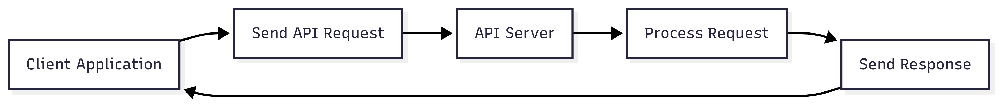
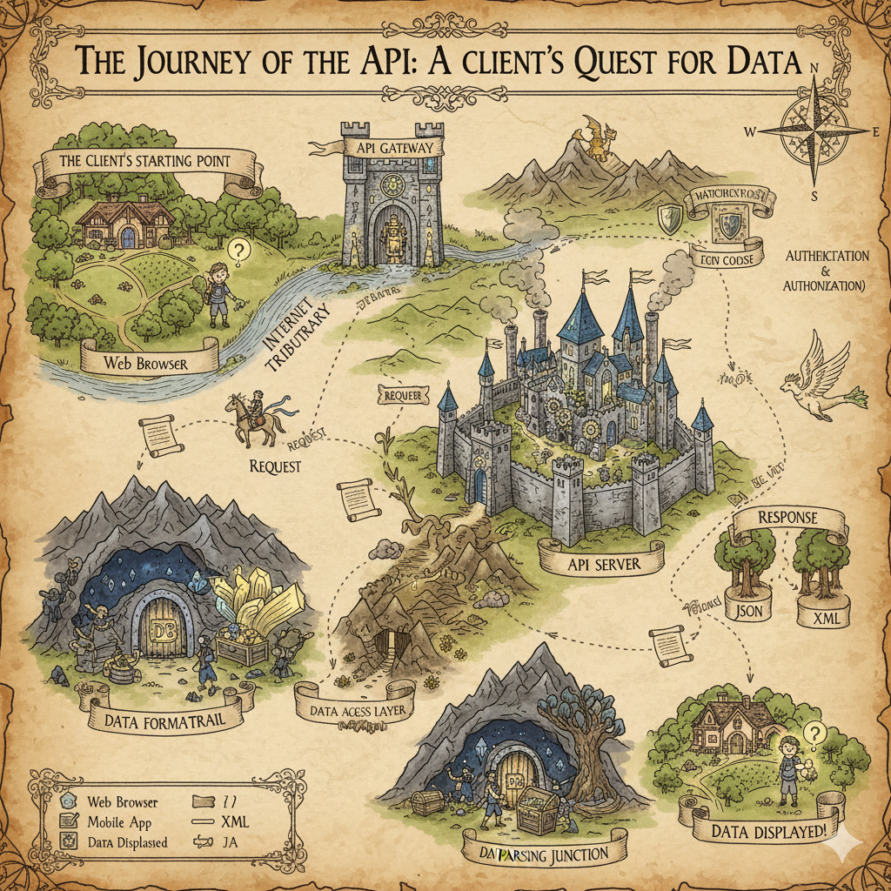

# Understanding API Documentation

## Introduction

Last year, in 2024, I started learning about (REST) API documentation partly out of pure curiosity, partly as a way to extend my technical writing knowledge. I completed the [I'd Rather Be Writing - API doc course](https://idratherbewriting.com/learnapidoc/) in both its written and [youtube video series](https://www.youtube.com/watch?v=NawxzLB4aro) formats, then dove into the [OpenAPI specification](https://swagger.io/specification/) directly from the source. But something was missing: the coding part! So I learned the basics of API coding in Python, enough to build the **conceptual bridge between API documentation theory, OpenAPI specification, and actual code**. It was enlightening to finally connect core API concepts (_endpoints_, _methods_, _requests/responses_, _data schemas_, _HTTP error codes_) with real code, specifications, and documentation.

Still, the **division of API documentation into "conceptual" and "reference" documentation** remained confusing to me. Reference documentation made sense—it's the comprehensive content for deeper system integration. But why call the practical, enablement-focused sections "conceptual"? Why not _"Hands-on documentation"_ or _"Enablement documentation"_? Looking at real API docs from various companies helped me realize that beyond reference documentation, most companies simply offer getting started guides and tutorials—the truly practical stuff.

Now that I'm reviewing my own API documentation samples, I decided to share the framework that helped me connect theory with practice. It cleared up my confusion and gave me a better way to think about API documentation structure. I hope you find it helpful too.

## What is an API?

API stands for Application Programming Interface, **a piece of code that allows communication and interaction (interface) between two systems** by defining available _resources_, interaction _methods_, _error codes_ and _how to handle them_, _authentication_ and _authorization_ means, and _data structures_ (schemas) for successful communication.&#x20;

Communication between systems using an API is based in a **request-response architecture** with the following workflow:

1. System A sends a request to System B using one of the available API methods and providing the required data structures.
2. System B receives the request.
3. System B confirms the authentication and authorization credentials of System A.
4. System B confirms it can serve the request and returns:

> * a status code
> * the requested information in the defined data structure.

**If something fails**, System B returns the appropriate error code and message.

Therefore, a basic API flow diagram could look like this:

<figure><figcaption></figcaption></figure>


**Check the appendix**

Learn more in the [Appendix](index.md#appendix): &#x20;

* [API core concepts](index.md#api-core-concepts) &#x20;
* A [Lord of the Rings version](index.md#visual-api-workflow-epic-alternative-diagram) of the API flow diagram.


## Organizing our API

Now that we understand what an API is, let's explore how we organize and design them. **There are different approaches to design APIs**, for example _Code First_, _API Design-First_, and hybrid approaches. Each approach has its pros and cons and picking one over the other depends on our company or product developer team culture (or preferences). In any case, **technical writers have to follow-up the design process closely** (or prepare for a round of Subject-Matter Expert interviews) to increase the chances of a successful documentation with minimal rework.

From a technical writing perspective, the **API Design-First approach appears to be the most documentation-friendly** because it gives us the chance to:

* Familiarize ourselves with the API's business goals and context.
* Participate in all design stages.
* Access the API contract or specification from the beginning.
* Start the documentation process early on, allowing us to anticipate the documentation structure.

If you're new to API documentation or the first technical writer in your product development team, **insist in participating in all API design meetings and discussions**. &#x20;


**Check the Appendix**

Learn more about [API Design](index.md#api-design-approaches) approaches.


## API Specifications

An API specification file is a **human and machine-readable file that describes an API's features, functionality, requirements, and resources** (mostly in YAML or JSON) . The most common API specifications are: &#x20;

* &#x20;[OpenAPI](https://www.openapis.org/what-is-openapi) - Focused on resource management) &#x20;
* [Arazzo](https://swagger.io/blog/the-arazzo-specification-a-deep-dive/) - Focused on user workflows.  &#x20;

The API specification file serves as **coding and documentation reference**, and even as a **contract among the parties** where we can find all the features, data schemas and means of communication provided by the API.

Think of [**OpenAPI**](https://www.openapis.org/what-is-openapi) **and** [**Arazzo**](https://swagger.io/blog/the-arazzo-specification-a-deep-dive/) **specifications as storytellers**—they're lists of objects that tell our API's story, abut how our API supports our customers' success. Each object has its own set of mandatory and optional constituent elements. These objects provide us, technical writers, with the **source material to create user-friendly and complete documentation**, both from scratch or using [Postman](https://learning.postman.com/)-like tools.

Remeber: The more complete our API specification file is, our chances of crafting a complete and successful documentation increase. &#x20;


**Check the Appendix**

Learn more about [Open API and Arazzo specifications](index.md#openapi-and-arazzo-specifications).


## So, What is API Documentation?

Until now we have so far learn about what an API is, how it works, its basic concepts, and the different API design approaches and specificationts. To connect all the dots, we could define API documentation as follows:

> API documentation is a piece of documentation focused on a developer audience. It describes what the API is, all the resources and means of interaction available for two systems to communicate successfully while providing working code examples to ensure user enablement. It also must include comprehensive reference content to support deeper system integration.

From this definition, it seems straightforward to distinguish between **"hands-on documentation"** (traditionally referred as "Conceptual documentation") and **"reference documentation"** (commonly referred as... well "Reference documentation").

On the one hand, what we called **Hands-on documentation** introduces our API to our users:

* What it is the API
* What it does
* Why it is useful
* How to get started quickly and securely
* Common workflows


The objective here is to **engage and enable our users to get started** working with our API securely and effectively.

On the other hand, **Reference documentation** provides comprehensive information about the intricacies of our API:

* A list of all the resources and the available methods
* Data schemas description for both requests and responses
* HTTP error codes and how to handle them
* Security means and implementation
* Rate limiting information
* Code samples

Keeping all of that in mind, an API documentation should provide, at least, the following information:

| Type of Documentation                                                                                           | Topics\*                                                                                                                                                                                                                                                                                                                                                                                                                                                                                                                                                                   |
| --------------------------------------------------------------------------------------------------------------- | -------------------------------------------------------------------------------------------------------------------------------------------------------------------------------------------------------------------------------------------------------------------------------------------------------------------------------------------------------------------------------------------------------------------------------------------------------------------------------------------------------------------------------------------------------------------------- |
| <p><strong>Hands-on documentation</strong><br>(<em>traditionally referred as Conceptual documentation</em>)</p> | <ol><li>Overview</li><li>Quick Start/Getting Started<br><em>Note: Include security procedure</em>s</li><li>How-Tos/Use-Case Tutorials</li><li>FAQ</li></ol>                                                                                                                                                                                                                                                                                                                                                                                                                |
| Reference documentation                                                                                         | <ol><li>Overview</li><li>Authentication and Authorization</li><li><p>Endpoints and Methods</p><ol><li>Request Parameters</li><li>Response Schema</li><li>Request/Response Examples (beyond just schema, actual JSON/XML bodies)</li></ol></li><li>Error Codes and Error Handling</li><li>Rate Limiting and Thresholds</li><li>Code Examples</li><li>Glossary</li><li>Best Practices</li><li>Changelog</li><li>SDKs/Libraries (if available, with links and usage info)</li><li>Environments (e.g., Sandbox, Production URLs)</li><li>Support/Contact Information</li></ol> |


**Recommendation**\
**R**ead the appendix sections to refresh what you have just read, and read this section again.  It may help to visualize the API docs better.


### How is it in the Real World?

Here's what I discovered when I looked at real API documentation in the wild: companies follow differnet naming conventions (with some touch points) to convey they API content. So remember that I said that:

> an API documentation should provide, at least, the following information

What does it mean? It means that **we can provide the information under different sections' naming** (and even add more sections or merge them!) as far as we address our API business goals and user's needs. In other words:&#x20;

> _Know your API's business, know your users' needs_.

The previous list of topics represents the main topics to cover in your API documentation topics, but it is not written in stone. Your API documentation have to address specific needs. So, _Know your API's business, know your users' needs_... _Then, craft and test!_

For example, if you customer or support department points out an increasing demand from customer to have specific API workflows documented, it makes sense to add them in your tutorials' section. Or, provide all the information regarding _Endpoint, Methods_ and _Code Examples_ under a single section, including _Error Codes and Error Handling_.

> _**Know your API's business, know your users' needs.**_

## Final Thoughts

Making sense of what we are learning helps us to go further, to take the next step. If APIs and API documentation seem like a complicated topic, think of it as a means of sharing with your users the story of your API, the story of how you API supports them to succeed.

This framework helped me make sense of API documentation—I hope it does the same for you.

## Appendix

### API Core Concepts

In the following table, you will find a basic API-related vocabulary descriptions:

| API Vocabulary                    | Description                                                                                                                                                                                                                                                                                                                                                                                                                                                                                        |
| --------------------------------- | -------------------------------------------------------------------------------------------------------------------------------------------------------------------------------------------------------------------------------------------------------------------------------------------------------------------------------------------------------------------------------------------------------------------------------------------------------------------------------------------------- |
| **Resources**                     | <p>Paths on a server where the API stores and provides data. For example: <code>/users</code>, <code>/users/{id}</code>, and <code>/{id}/products</code>.</p><p>Think of them as unique URLs for specific pieces of information.</p>                                                                                                                                                                                                                                                               |
| **Method**                        | <p>The action you want to perform on a resource, defined by an HTTP verb. The most common ones are:</p><ul><li><code>GET</code> - To <strong>read</strong> a resource.</li><li><code>POST</code> - To <strong>create</strong> a new resource.</li><li><code>PUT</code> - To <strong>completely replace</strong> or update a resource.</li><li><code>DELETE</code> - To <strong>remove</strong> a resource.</li><li><code>PATCH</code> - To <strong>partially update</strong> a resource.</li></ul> |
| **Request**                       | A structured message sent by a client (System A) to a server (System B) . This message includes the desired **Method**, the **Resource** path, and sometimes data. An example is: `HTTP GET http://www.appdomain.com/users`.                                                                                                                                                                                                                                                                       |
| **Response**                      | The structured answer a server (System B) sends back to a client (System A) after receiving a **Request**. It includes an HTTP **Status Code**, an optional message, and the requested data. The most common data formats are **JSON** and **XML**.                                                                                                                                                                                                                                                |
| **Status Codes** and **Messages** | <p>HTTP protocol numeric codes and messages that tell you the result of a <strong>Request</strong> whether a request was successful, failed, or needs more information.</p><p>The codes are grouped into five categories: <code>1xx</code> (Informational), <code>2xx</code> (Success), <code>3xx</code> (Redirection), <code>4xx</code> (Client Errors), and <code>5xx</code> (Server Errors).</p>                                                                                                |
| **Authentication**                | The process of verifying a user’s or client’s identity. It’s like showing your ID to prove you are who you say you are before you can access an API.                                                                                                                                                                                                                                                                                                                                               |
| **Authorization**                 | The process of checking if an authenticated user or client has permission to access a specific resource or perform a certain action.                                                                                                                                                                                                                                                                                                                                                               |
| **Data Structure** or **Schema**  | <p>The blueprint or rules for organizing the data that is exchanged between the client and the server. It defines what fields are required, their data types, and how the information should be organized.</p><p>The most popular formats for this are <strong>JSON</strong> and <strong>XML</strong>.</p>                                                                                                                                                                                         |

### Visual API Workflow (Epic Alternative Diagram) &#x20;

<figure><figcaption></figcaption></figure>

### Python API Code Example

In the following Python code example, you will find a simple API code with explanatory comments:

```python
from flask import Flask, request, jsonify

# This line creates our web application. Think of it like opening our pet store's front door
# ready to receive visitors (requests).
app = Flask(__name__)

# --- Our Pet Store's "Database" (just a simple list for this example) ---
# This is where we keep track of our pets. Each pet has an ID, a name, a species, and a status.
# In a real store, this would be a proper database.
pets = [
    {"id": "p1", "name": "Buddy", "species": "dog", "status": "available"},
    {"id": "p2", "name": "Whiskers", "species": "cat", "status": "available"},
    {"id": "p3", "name": "Goldie", "species": "fish", "status": "adopted"},
]

# --- API Endpoint: Get All Pets or a Specific Pet ---
# This is like asking "What pets do you have?" or "Tell me about pet p1?"
# The address for this is typically '/pets' or '/pets/<pet_id>'
@app.route('/pets', methods=['GET'])
def get_pets():
    # If someone asks for all pets (e.g., visiting '/pets'), we give them the full list.
    return jsonify(pets)

@app.route('/pets/<string:pet_id>', methods=['GET'])
def get_pet(pet_id):
    # This loop goes through our pet list to find the one with the matching ID.
    for pet in pets:
        if pet['id'] == pet_id:
            # If we find the pet, we show its details.
            return jsonify(pet)
    
    # --- Error Handling Example 1: Pet Not Found ---
    # If we look through all our pets and can't find the one requested,
    # we send back a "404 Not Found" message. This tells the requester
    # that the pet ID they provided doesn't exist in our store.
    return jsonify({"error": "Pet not found"}), 404

# --- API Endpoint: Update an Existing Pet ---
# This is like telling the store, "I want to change something about pet p1."
# The address is '/pets/<pet_id>' and we use the 'PUT' method.
@app.route('/pets/<string:pet_id>', methods=['PUT'])
def update_pet(pet_id):
    # We expect the person sending the request to also send us the new details
    # for the pet in a structured format (JSON).
    data = request.get_json()
    
    # --- Error Handling Example 2: Missing Data ---
    # We check if they actually sent us any new information. If 'data' is empty,
    # it means they didn't provide any updates, so we send a "400 Bad Request" error.
    if not data:
        return jsonify({"error": "No data provided for update"}), 400

    # Find the pet in our list that matches the ID.
    for pet in pets:
        if pet['id'] == pet_id:
            # Once found, we update its information with the new data received.
            # For example, if 'name' was in the data, we update the pet's name.
            pet.update(data)
            # Then we send back the updated pet's details as confirmation.
            return jsonify(pet)
            
    # If we can't find the pet to update, it's another "404 Not Found" error.
    return jsonify({"error": "Pet not found"}), 404

# --- How to Run Our Pet Store API ---
# This part makes our pet store "open for business" on your computer.
# When you run this Python file, it starts a small web server.
# You can then access it through your web browser or other tools.
if __name__ == '__main__':
    app.run(debug=True) # 'debug=True' is helpful for development, shows more info if something goes wrong.

```

### API Design Approaches

In the following table, you'll find an informative description of the different API design approaches:

| API Coding Approach  | Description                                                                                                                                                                                                                             | Pros                                                                                                                                                                                                                                                                                                                | Cons                                                                                                                                                                                                                                   |
| -------------------- | --------------------------------------------------------------------------------------------------------------------------------------------------------------------------------------------------------------------------------------- | ------------------------------------------------------------------------------------------------------------------------------------------------------------------------------------------------------------------------------------------------------------------------------------------------------------------- | -------------------------------------------------------------------------------------------------------------------------------------------------------------------------------------------------------------------------------------- |
| **Code-First**       | You start by writing your API's implementation code, then use tools or annotations within your code to generate the API specification (like OpenAPI/Swagger) automatically. The code is the source of truth.                            | <p>- <strong>Faster development:</strong> Jump straight into coding with auto-generated documentation.</p><p>- <strong>Always synchronized:</strong> Documentation updates automatically with code changes.</p>                                                                                                     | <p>- <strong>Design can be an afterthought:</strong> May lead to less consistent or well-thought-out API designs.</p><p>- <strong>Tool dependency:</strong> Relies heavily on code generation tools, which might have limitations.</p> |
| **API Design-First** | You begin by designing and defining your API using an API specification language (like OpenAPI/Swagger, RAML, API Blueprint) before writing any code. Tools then generate boilerplate code or documentation from this specification.    | <p>- <strong>Improved API quality:</strong> Forces thoughtful design from the start.</p><p>- <strong>Early feedback:</strong> Stakeholders can review the API design before development begins.</p><p>- <strong>Parallel development:</strong> Frontend and backend teams can work concurrently using the spec.</p> | <p>- <strong>Slower initial setup:</strong> Requires an extra design step before coding begins.</p><p>- <strong>Syncing challenges:</strong> If code deviates from the spec, manual updates are needed.</p>                            |
| **Hybrid Approach**  | Combines elements of both Code-First and Design-First. You might start with a high-level design document or a rough spec, then implement the core API with Code-First tools, and finally refine the specification and code iteratively. | <p>- <strong>Balances speed and quality:</strong> Get started quickly but still benefit from design principles.</p><p>- <strong>Flexibility:</strong> Can adapt to project needs and team strengths.</p>                                                                                                            | <p>- <strong>Complexity:</strong> Can be harder to manage the workflow and keep everything synchronized.</p><p>- <strong>Requires discipline:</strong> Needs a clear process to ensure design and code remain aligned.</p>             |

### OpenAPI and Arazzo Specifications

In the following table you'll find a description of the OpenAPI and Arazzo specifications and the best use cases for them:

| API Specification               | Description                                                                                                                                                                                                                                                                                                                                                                                                                                       | Best Use Cases                                                                                                                                                                                                                                                                                                                                                                                                                                                                                                                                                                                                                                                                                                                                                                        |
| ------------------------------- | ------------------------------------------------------------------------------------------------------------------------------------------------------------------------------------------------------------------------------------------------------------------------------------------------------------------------------------------------------------------------------------------------------------------------------------------------- | ------------------------------------------------------------------------------------------------------------------------------------------------------------------------------------------------------------------------------------------------------------------------------------------------------------------------------------------------------------------------------------------------------------------------------------------------------------------------------------------------------------------------------------------------------------------------------------------------------------------------------------------------------------------------------------------------------------------------------------------------------------------------------------- |
| **OpenAPI Specification (OAS)** | A widely adopted, language-agnostic standard for **describing RESTful APIs**. It focuses on defining the API's surface: endpoints, operations, parameters, responses, and security schemes. It's essentially the blueprint for _what_ an API does.                                                                                                                                                                                                | <p>- <strong>Defining API Contracts:</strong> Creating a clear, machine-readable definition of a REST API.</p><p>- <strong>Automated Tooling:</strong> Generating documentation (Swagger UI), client SDKs, server stubs, and testing tools.</p><p>- <strong>Design-First Development:</strong> Collaborating on API design before coding begins.</p><p>- <strong>API Discovery &#x26; Consumption:</strong> Helping developers understand and integrate with APIs quickly.</p>                                                                                                                                                                                                                                                                                                        |
| **Arazzo Specification**        | A new specification focused on **describing API-level callbacks, webhooks, and asynchronous API interactions**. Unlike OpenAPI, which defines the initial request-response contract, Arazzo describes the _events and messages_ that an API might send or receive asynchronously _after_ an initial request, often involving a client-provided callback URL. It provides a formal way to define "reverse calls" or event-driven patterns in APIs. | <p>- <strong>Defining Webhooks:</strong> Clearly specifying how an API will notify a client of events.</p><p>- <strong>Asynchronous API Workflows:</strong> Documenting long-running processes where the API calls back to the client upon completion or status change.</p><p>- <strong>Event-Driven Architectures:</strong> Formalizing the structure of events and callback messages.</p><p>- <strong>Microservices Communication:</strong> Detailing asynchronous inter-service communication patterns where one service triggers actions in another via callbacks.</p><p>- <strong>Enhancing OpenAPI:</strong> Arazzo is designed to complement OpenAPI, describing the asynchronous <em>behavior</em> of an API that OpenAPI defines the synchronous <em>interface</em> for.</p> |

### OpenAPI Specification Example

The following piece of an incomplete OpenAPI specification file shows some of those objects:

```yaml
openapi: 3.0.4
info:
externalDocs:
servers:
tags:
  /pet:
    put:
      tags:
      summary: Update an existing pet.
      description: Update an existing pet by Id.
      operationId: updatePet
      requestBody:
        description: Update an existent pet in the store
        content:
          application/json:
            schema:
              $ref: '#/components/schemas/Pet'
          application/xml:
            schema:
              $ref: '#/components/schemas/Pet'
          application/x-www-form-urlencoded:
            schema:
              $ref: '#/components/schemas/Pet'
        required: true
      responses:
        '200':
          description: Successful operation
          content:
            application/json:
              schema:
                $ref: '#/components/schemas/Pet'
            application/xml:
              schema:
                $ref: '#/components/schemas/Pet'
paths:
components:
```


**Complete openAPI specification**

Check a [complete example](https://editor.swagger.io/) of an openAPI specification to have a wider view of its content.

